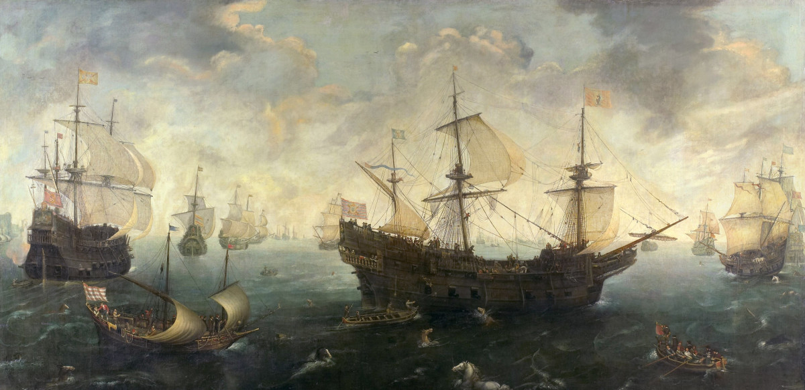

# Armada

**DISCLAIMER: This software is not production ready**

# Overview

Armada is a gameserver orchestration software that is improved for 
scalability and reliability. It is used at twerion to deploy and scale the
gameservers.

## Use of Zookeeper

Unscheduled ships are added to a Zookeeper Queue under path 
`/armada/scheduler/queue`. The *ApiServer* will mostly just write to 
Zookeeper and use *Etcd* for more 
frequent lookups. The main objective is to keep the amount of *Queries per 
Second* low. After the scheduler assigned a host to a ship, the ship is added
to the hosts queue of unstarted ships, which is under path 
`/armada/worker/{worker-id}/queue`. The worker watches it's path and will start
or reschedule jobs that are added to the queue. Zookeeper is also used for
leader election of various components (Scheduler, Controllers, ...). As opposed
to *Etcd*, more components than the *ApiServer* are allowed to access 
*Zookeeper* directly. *Netflix* published a Tech Node (https://github.com/Netflix/curator/wiki/Tech-Note-4)
which stated that *Zookeeper* should not be used for queues. After looking at it
we still stuck with *Zookeeper* for the following reasons:

  - The size of all queues is relatively small
  - The queues elements size is small
  - There are only a view of components that connect to *Zookeeper* but the
    ones that do should be able to make use of it fully. 
   
 The only components connecting to *Zookeeper* are: The scheduler, every 
 Worker and the *ApiServer* instances. While the *Advisors* stats are
 also written into the *Zookeeper* tree, it will only ever connect to the
 *ApiServer*.

## Use of Redis
The *ApiServer* is the only component that may read or write to *Redis*. 
*Redis* is mainly used to store the cluster state and *ShipBlueprints*.
The *Advisor* will use the *MonitorService* of the *ApiServer* to update 
resource info. The info and state of a *Ship* is also in etcd. 
